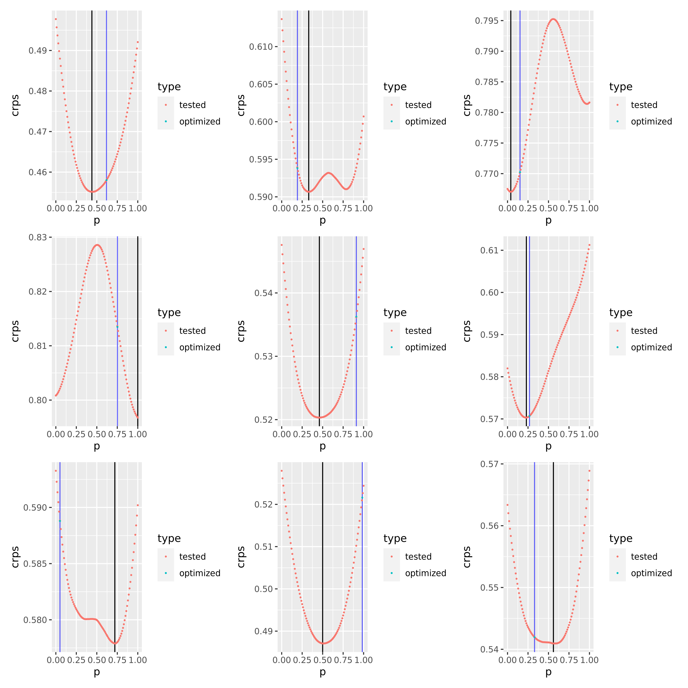

```{r setup, include=FALSE,eval=FALSE}

```


## Check that model stacking works well if the true model is not included

As a simple first check, we simulate a vector with 30 'true' observations 
from a standard normal distribution. Two models then generate 80 predictive 
samples for each observation from a normal distribution with constant random mean 
(the mean itself is drawn from a standard normal distribution) and variance 1. 

The weights are then optimized and compared against a grid of weights (here 
denoted by p and (1-p) correspondingly) ranging 
from 0 to 1 in steps of 0.01. Ensembles are formed by weighting the two 
predictive samples accordingly. In black, the minimum CRPS value is 
marked on the plots. 



```{r}

```

